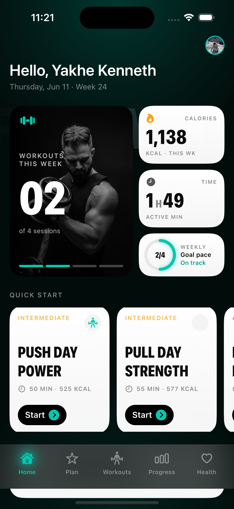
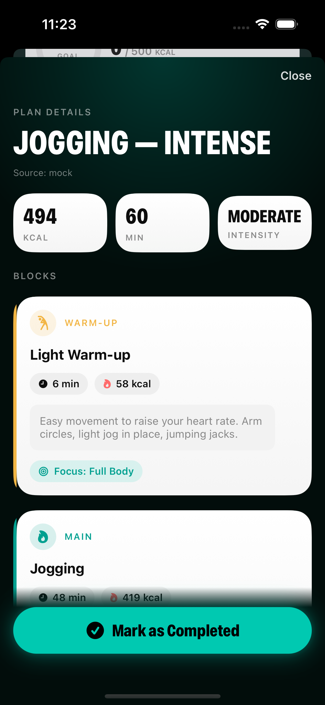
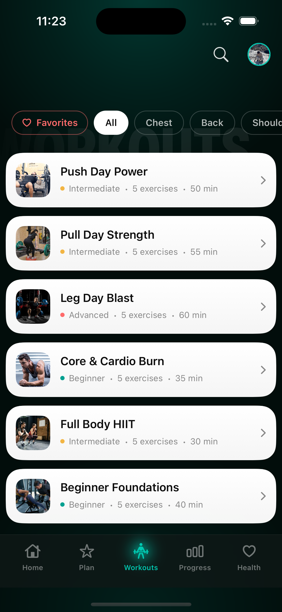
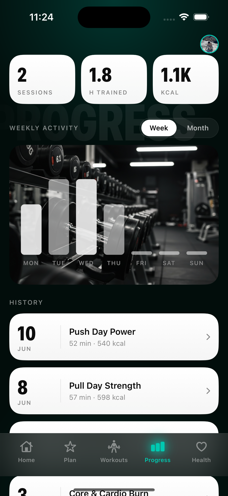
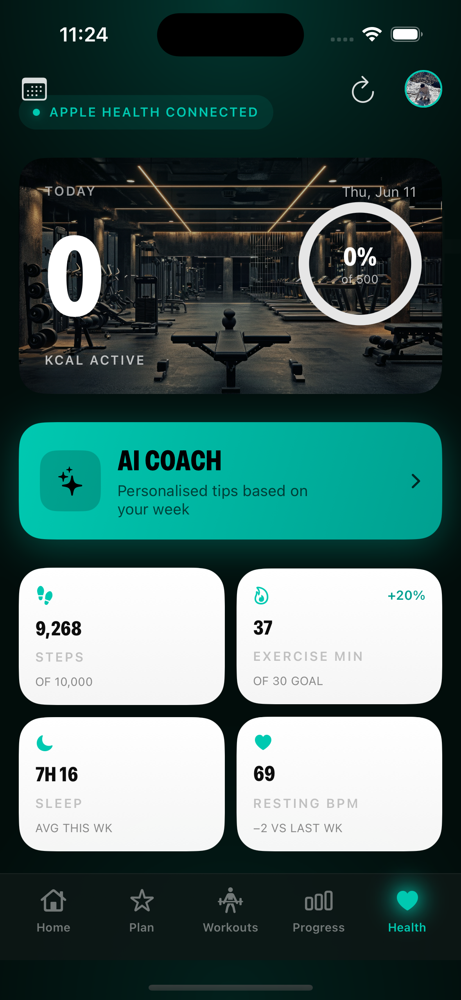
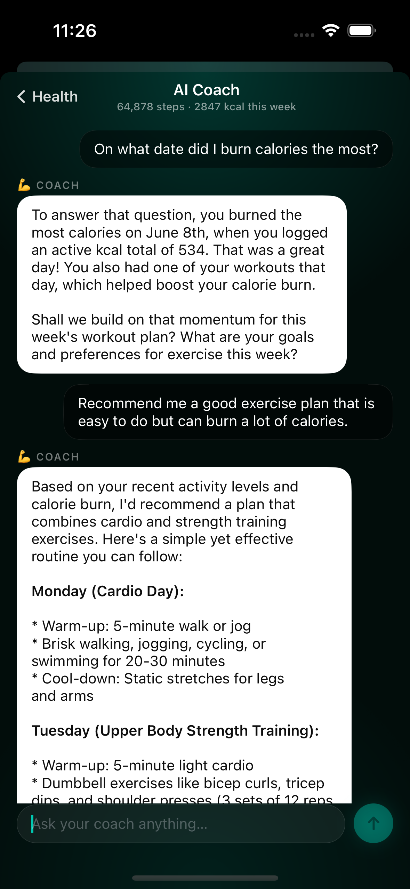
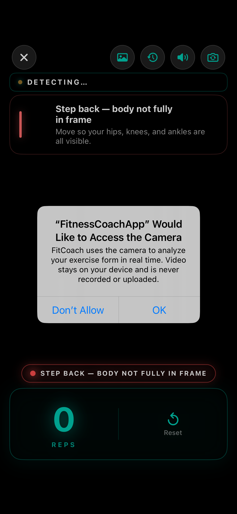
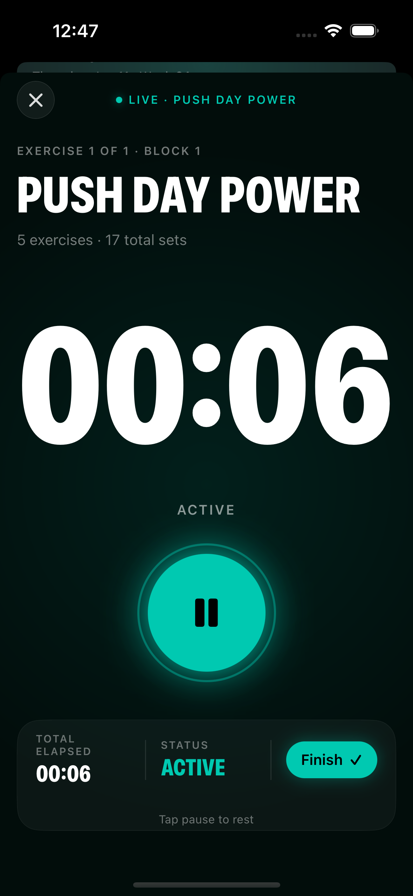

# FitnessCoach — AI-Powered iOS Fitness App

A SwiftUI iOS application that combines real-time pose detection, HealthKit integration, and a multi-agent AI coaching system built with CrewAI.

---

## Screenshots

<table>
  <tr>
    <td align="center"><br/><sub>Home</sub></td>
    <td align="center"><br/><sub>AI Generated Plan Details</sub></td>
    <td align="center"><br/><sub>Workouts</sub></td>
    <td align="center"><br/><sub>Progress</sub></td>
  </tr>
  <tr>
    <td align="center"><br/><sub>Health Dashboard</sub></td>
    <td align="center"><br/><sub>AI Coach Bot</sub></td>
    <td align="center"><br/><sub>Camera Tracking Vision</sub></td>
    <td align="center"><br/><sub>Exercise Time</sub></td>
    <td></td>
  </tr>
</table>

---

## Features

### iOS App
- **Authentication** — Firebase Auth with email/password login, registration, and onboarding flow
- **Home** — personalized greeting with AI coaching messages from the CrewAI backend
- **Workout Recommendations** — rule-based engine that scores and selects exercises based on user profile, goals, and recent session history
- **Active Session** — real-time workout timer with rep tracking and session logging
- **Pose Detection** — live camera feed with Vision framework skeleton overlay and form feedback for squats, push-ups, and lunges
- **Form Analysis** — CoreML squat classifier (`SquatFormClassifier.mlmodel`) with real-time good/bad form feedback
- **Health Dashboard** — HealthKit integration displaying steps, calories, heart rate, and sleep data
- **Progress Tracking** — workout history charts and activity trends
- **Profile** — user settings, fitness goals, and personal stats

### CrewAI Backend
Three-agent orchestration system powered by a local Ollama LLM:

| Agent | Role |
|---|---|
| **UI Agent** | Analyzes SwiftUI structure and suggests UI improvements |
| **HealthKit Agent** | Reads fitness data and generates personalized coaching advice |
| **QA Agent** | Reviews and validates outputs from the other two agents |

---

## Tech Stack

| Layer | Technology |
|---|---|
| iOS UI | SwiftUI |
| Authentication | Firebase Auth |
| Database | Cloud Firestore |
| Health Data | HealthKit |
| Pose Detection | Vision framework (VNDetectHumanBodyPoseRequest) |
| Form Classification | CoreML (custom trained model) |
| AI Backend | CrewAI + Flask |
| LLM | Ollama (llama3.2:3b) |
| Language | Swift, Python |

---

## Architecture

```
iOS App (SwiftUI)
    │
    ├── Firebase Auth & Firestore
    ├── HealthKit
    ├── Vision + CoreML (on-device)
    │
    └── HTTP POST ──▶ Flask API (Lab Mac :5001)
                            │
                            └── CrewAI Agents
                                    │
                                    └── Ollama LLM (llama3.2:3b)
```

---

## Project Structure

```
FitnessCoachApp/
├── FitnessCoachApp/
│   ├── Views/
│   │   ├── Auth/          # Login, Register, Onboarding
│   │   ├── Home/          # Home screen + AI coaching message
│   │   ├── Workouts/      # Workout list + active session
│   │   ├── Workout/       # Workout recommendations
│   │   ├── PoseDetection/ # Live camera + skeleton overlay
│   │   ├── Health/        # HealthKit dashboard
│   │   ├── Progress/      # Charts and history
│   │   ├── Profile/       # User profile
│   │   └── Coaching/      # A2A coaching view
│   ├── ViewModels/        # ObservableObject view models
│   ├── Models/            # Data models (Exercise, Workout, UserProfile)
│   ├── Services/
│   │   ├── AuthService.swift
│   │   ├── Recommendation/  # Rule-based workout recommender
│   │   └── Vision/          # Pose analyzers + CoreML classifier
│   └── Shared/            # Reusable components
├── CrewAI/
│   ├── agents.py          # Three CrewAI agents definition
│   ├── server.py          # Flask API server
│   └── train_squat_classifier.py
└── AppleHealthAgent/      # Agent card configuration
```

---

## Getting Started

### Prerequisites
- Xcode 14.3+
- iOS 16+
- Python 3.10+
- Ollama installed on an accessible machine

### iOS Setup
1. Clone the repository
2. Open `FitnessCoachApp.xcodeproj` in Xcode
3. Add your own `GoogleService-Info.plist` from Firebase Console
4. Set your development team in **Signing & Capabilities**
5. Build and run on a device or simulator

### CrewAI Backend Setup
```bash
cd CrewAI
pip install flask crewai
python server.py
```

The Flask server runs on port `5001`. Update the base URL in the iOS networking layer to match your machine's IP address.

### Ollama Setup
```bash
ollama pull llama3.2:3b
OLLAMA_HOST=0.0.0.0:11434 ollama serve
```

> All three machines (iOS device, Flask server, Ollama server) must be on the same Wi-Fi network.

---
